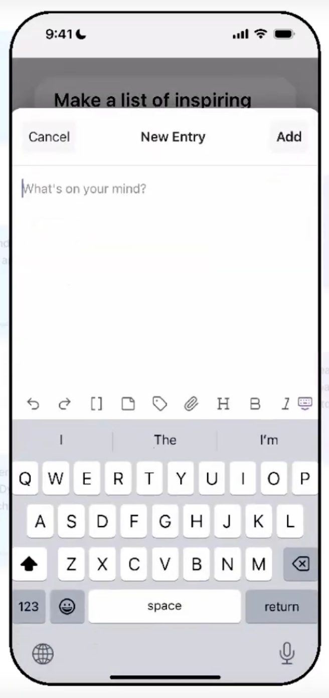

# PRD — Inklings (Focus)

## 1) Purpose

Surface **one inkling at a time** from your Obsidian vault so you can quickly add a dated blurb and then move on. Navigation is **swipe-only** (no list), and you can **snooze** any inkling for a few days.

## 2) Scope (MVP)

* Obsidian plugin (mobile + desktop).
* One-screen **Focus View** with:

  * Title (H1).
  * Reverse-chronological dated sections:

    * **`YYYY-MM-DD`** (small, gray header).
    * Free-form text directly beneath (paragraphs; no bullets required).
  * **FAB “+”** to add today’s entry.
  * **Snooze** pill button (shows exact target date).
* **Swipe left/right** to move next/previous within a randomized deck.
* **Snooze** excludes the inkling for a fixed period.
* No queues/scoring/search/tags UI.

## 3) Your final decisions (apply exactly)

* **File order = UI order**: newest date section first in the file (reverse chronological).
* **Swipe-back depth** limited to items already seen in the current deck session.
* **Snooze label** shows the **ISO date** (e.g., `2025-09-08`), not “until Friday”.
* **Deck uses all eligible inklings** under the configured folder (no cap).

## 4) Data model & file format

* **Folder** (setting): default `Inklings/`
* **Frontmatter**

  ```yaml
  ---
  type: inkling
  snoozed_until: 2025-09-08   # optional ISO date; when present and > today, exclude
  ---
  ```
* **Body (reverse chronological)**

  ```md
  # <Title>

  ### 2025-09-05
  Today’s blurb…

  ### 2025-08-27
  Earlier thought…
  ```
* **First date section** ever added is implicitly the “seed”. No special handling or labeling.
* Plugin **never writes** `lastmod` (reads it if present but ignores for logic).

## 5) Actions & flows

### Open Focus

Screenshot: 

* Command: **Inklings: Open Focus** → build deck (see §6) → show current note.
* Bottom controls: **FAB “+”**, **Snooze (YYYY-MM-DD)**.

### Add Entry

Screenshot: 

* Tap **+** → sheet “New Entry” (multiline).
* **Add**:

  * If `### <today>` exists: append a new paragraph under it.
  * Else **insert a new `### <today>` section at the top** of the file (just under the title).
* Close sheet; re-render.

### Snooze

* Tap **Snooze**:

  * Write `snoozed_until = today + N days` (default **3**; setting).
  * Advance immediately to next inkling.
  * Label always shows the exact target date (ISO).

### Swipe navigation

* **Left** → next item in deck.
* **Right** → go back (only within the items already viewed this session).
* When the deck ends → empty state with “Shuffle new deck” and “Create inkling”.

## 6) Deck construction

* **Eligible** files:

  * In configured folder.
  * `type: inkling` (or absent → default to include).
  * `snoozed_until` absent or `<= today`.
* **Order**: Fisher–Yates shuffle of all eligible at session start.
* Maintain **index + back stack** for swipe-back.

## 7) Settings

* `folder` (string, default `"Inklings/"`)
* `snoozeDays` (int, default `3`)
* `dateHeaderLevel` (default `"###"`) — for the date section

## 8) UI details

* Follow Obsidian light/dark.
* Title: large H1.
* Date header: system caption color, `YYYY-MM-DD`, smaller than body.
* Body: regular text; paragraphs separated by a blank line.
* Bottom: centered **FAB “+”**; right **Snooze** pill with ISO date.

## 9) Edge cases

* **No eligible notes** → show empty state (buttons: Create inkling / Shuffle).
* **Malformed/missing date headers** → show raw body; adding an entry creates `### <today>` at top.
* **Concurrent edits** → atomic modify; last-write wins.
* **Vault changes** → listen for file create/modify/rename; invalidate deck.

## 10) Acceptance criteria

* Focus shows a single inkling with date-grouped entries **newest first** in **both UI and file**.
* Swipe left/right navigates forward/back within a shuffled deck of **all eligible** notes.
* **+ Add** inserts under today’s header (creating it at the top when absent).
* **Snooze** sets `snoozed_until` accurately and advances; label displays the correct ISO date.
* Plugin never writes `lastmod`.
* Works on Obsidian Mobile and Desktop.
